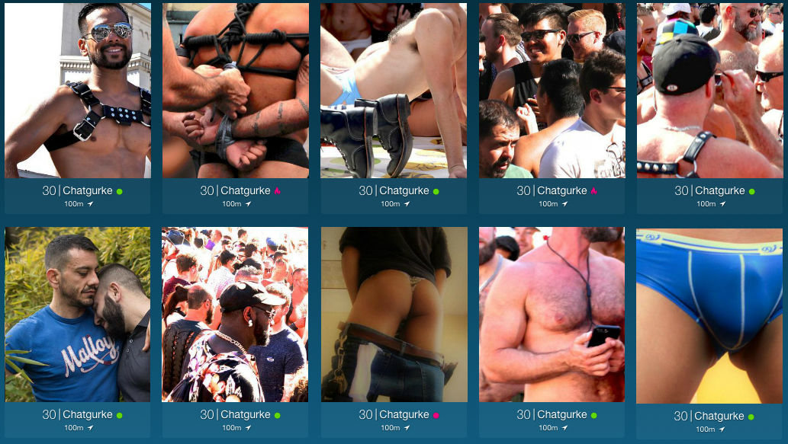

# Erasys React Native Trial Task
Users are very important on ROMEO. That's why we want you to implement an app that shows a list of users. We have included a simple server with two API endpoints that give you the required data.

## Requirements
- Create a React Native application that shows the results in a layout similar to the following screenshot:


- Make sure that a single item in the list shows **all** of the following data (you might need to combine some data sources for this):
  - Username
  - Age
  - Image
  - Location and distance
  - Headline
  - Relative last login time (e.g. 6 minutes ago)

  *The screenshot above is just an illustration of what we have in mind. Feel free to use it as a starting point, or implement your own design.*
  
- You can use any additional packages or frameworks you feel are beneficial to the project
- The new code must be written in Typescript
- The app should be able to run on all platforms (Android, iOS, Web)
- The app can be added to this existing codebase (via git clone) or written externally, but it **must** work alongside the server in this repo.
- Include your `git` history when you send us your code
- Update this README.md to include any additional information you think is relevant to your submission, including setup instructions.

## Server
1. Clone this repository
2. `npm install`
3. `npm start`
4. The API is available on [http://localhost:3000](http://localhost:3000)

## API description
### `GET /api/search?length=32`
### `GET /api/search?length=32&sorting=[DISTANCE|ACTIVITY]`
Returns a list of user profiles with some basic information.

#### Example output
```javascript
{
  "cursors": {
    "after": (string)
  },
  "total": (number),
  "items": [{
    "id": (string),
    "name": (string),
    "picture": {
      "comment": (string),
      "url": (string)
    },
    ...
  }]
}
```

### `/api/profiles?ids=_id1_&ids=_id2_&ids=...`
Returns an array of detailed user data matching the given ids.

#### Example output
```javascript
[
  {
    "id": (string),
    "location": {
      "name": (string),
      "distance": (number)
    },
    "headline": (string),
    "personal": {
      "age": (number),
      ...
    },
    "sexual": {
      "anal_position": (string),
      ...
    },

    {
      "id": (string),
      ...
    }
]
```

Please note: Whilst the project does not contain any explicit content, it does use images
that might draw unwanted attention in some countries. If you are worried about running this
project, you can use `npm run safe-start` to replace socially contentious content with something
less so.